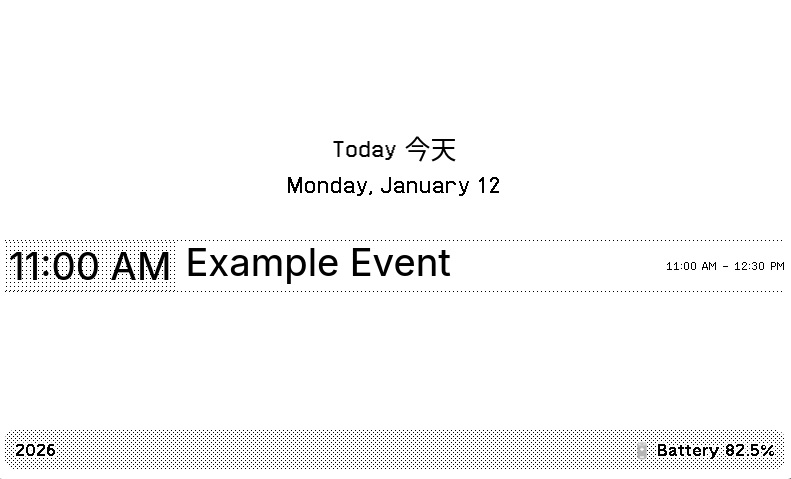
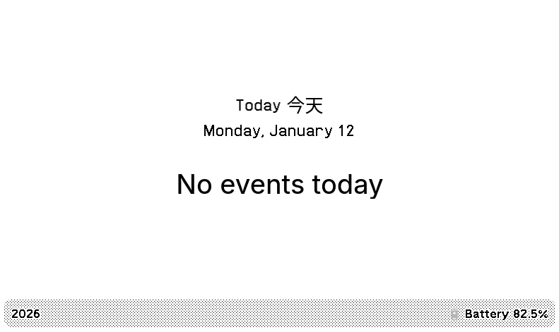

Simple TRMNL plugin to show today and tomorrow's events.

Run off a simple python script posting data to TRMNL's webhook url.

## Example Screenshots

Single Day screen

No events for the given day

